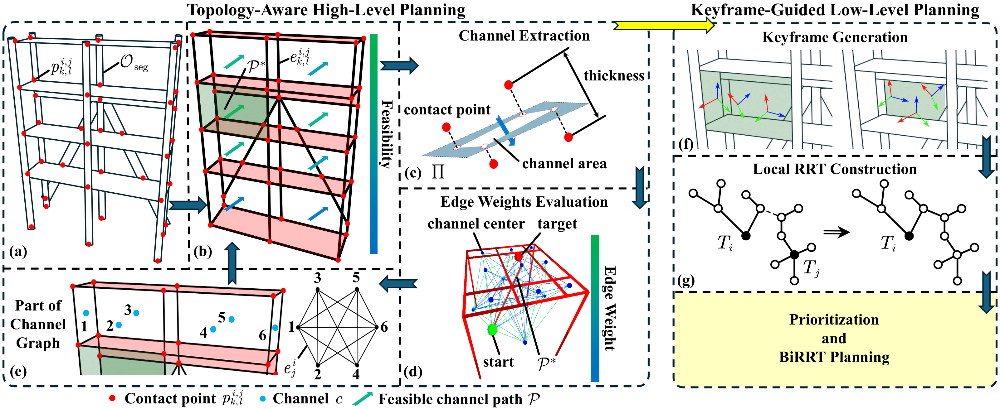
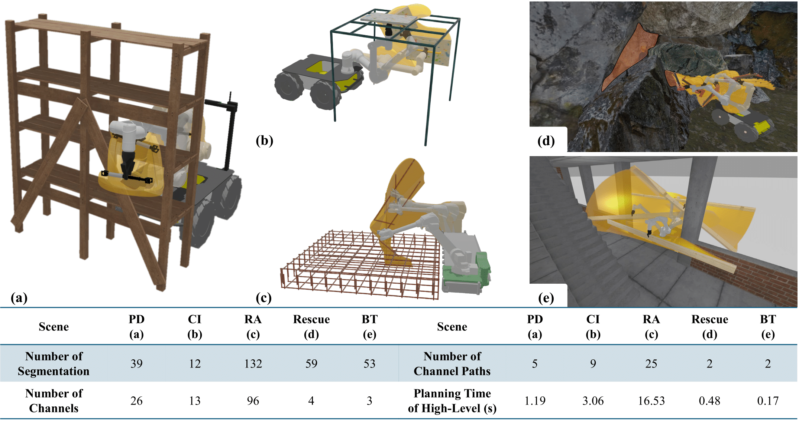
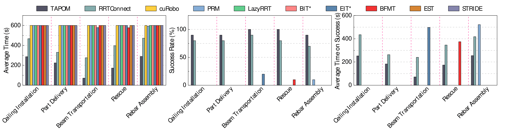

# TAPOM: Task-Space Topology-Guided Motion Planning for Manipulating Elongated Object in Cluttered Environments

This is the TAPOM source code, but due to time constraints, which run instructions and installation instructions we will complete later.




[![[Submitted to RAL 2025] TAPOM - YouTube](https://res.cloudinary.com/marcomontalbano/image/upload/v1749912104/video_to_markdown/images/youtube--G7N8VYgaefw-c05b58ac6eb4c4700831b2b3070cd403.jpg)](https://www.youtube.com/watch?v=G7N8VYgaefw "[Submitted to RAL 2025] TAPOM - YouTube")

## Installation (Unfinished)

* create virtual env

```bash
conda create -n husky_assembly python==3.9.19
conda activate husky_assembly
```

* install python dependencies

```bash
conda install pinocchio -c conda-forge
pip install numpy pybullet_planning torch matplotlib casadi compas_fab
```

* install curobo https://curobo.org/get_started/1_install_instructions.html

* install OMPL with python bindings https://ompl.kavrakilab.org/core/installation.html

## How to Run?

Coming soon...
