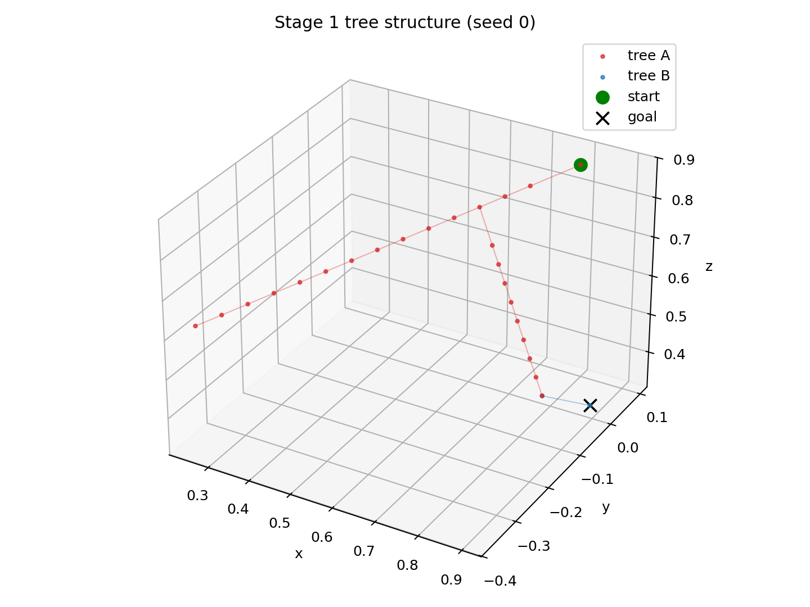
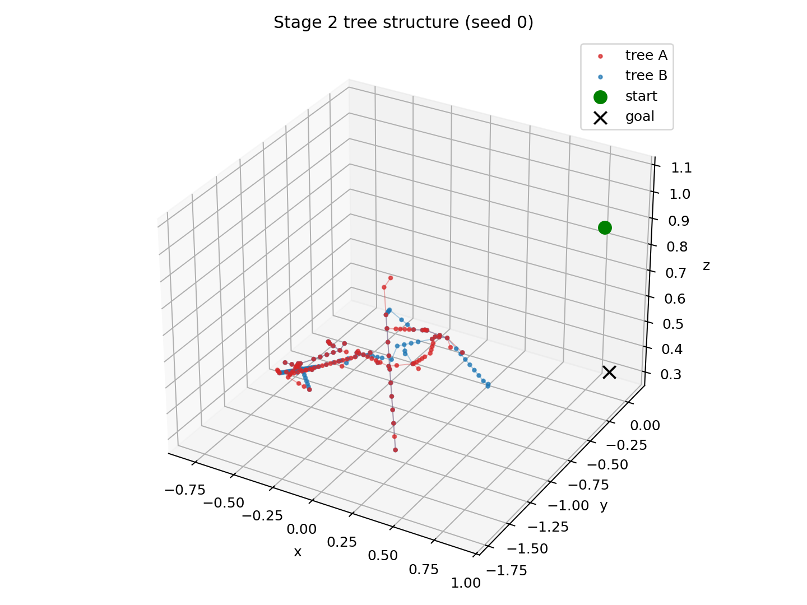
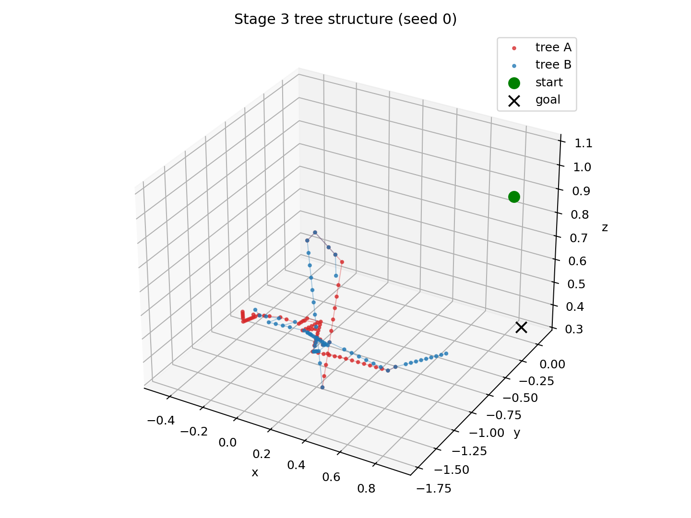
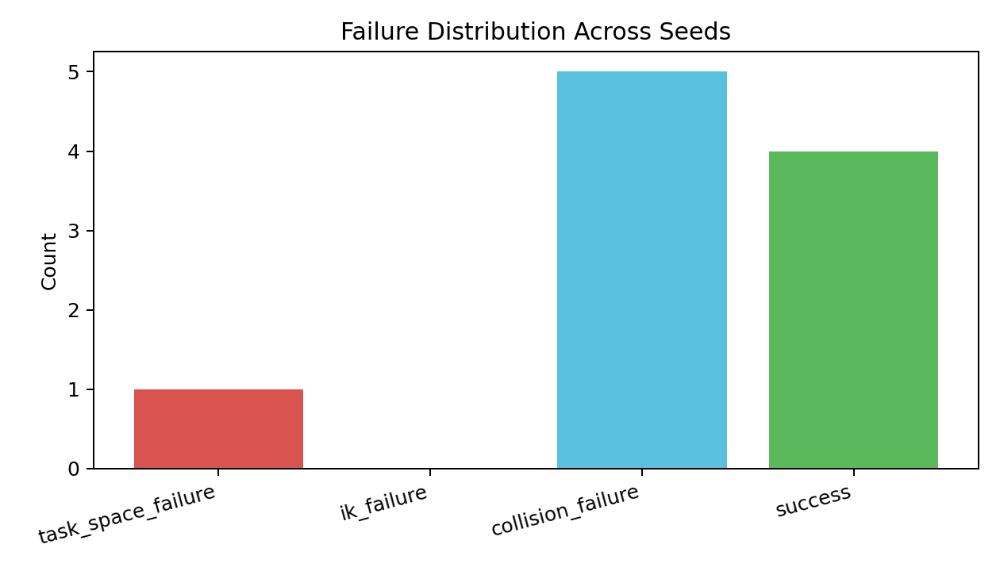
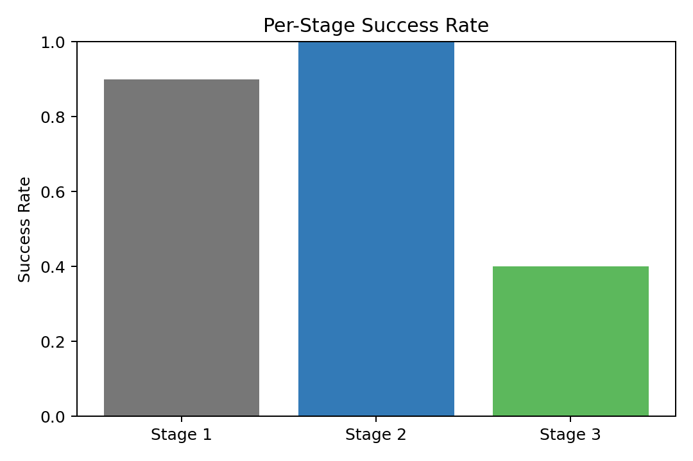

# Dual-Arm Planner Debugging Report (2026-03-10)

## Scope

This report summarizes results from:

- `failure_analysis_20260310_121640.json`
- `failure_analysis_20260310_121640.csv`
- `failure_distribution_20260310_121640.png`
- `stage_success_20260310_121640.png`
- `tree_structure_stage1_seed0_20260310_121640.png`
- `tree_structure_stage2_seed0_20260310_121640.png`
- `tree_structure_stage3_seed0_20260310_121640.png`

Run setup:

- Trials: `10` seeds (`0..9`)
- Per-attempt max time: `30.0s`
- Stage comparison: Stage 1 / Stage 2 / Stage 3

---

## 1) Workspace Tree Visualization

### Stage 1 (seed 0)

Observation:

- Sparse/simple exploration pattern.
- Limited branching and mostly direct geometric growth.

### Stage 2 (seed 0)

Observation:

- Significantly wider branching and exploration footprint.
- Enabling IK introduces larger search complexity.

### Stage 3 (seed 0)

Observation:

- Similar broad envelope to Stage 2, but effective growth is more constrained.
- Collision checks appear to prune many candidate continuations.

Interpretation:

- Tree structure differences across stages are visible and consistent with constraint layering:
  - Task-space only < IK-enabled < collision-constrained difficulty.

---

## 2) Failure Distribution Analysis

### Distribution plot

From `summary.counts`:

- `task_space_failure`: **1 / 10** (10%)
- `ik_failure`: **0 / 10** (0%)
- `collision_failure`: **5 / 10** (50%)
- `success`: **4 / 10** (40%)

### Bottleneck conclusion

Dominant failure mode in this run is **collision-level failure** (50%).  
IK-level failure is **not** dominant (0% in this batch).

---

## 3) Per-Stage Comparison

### Success-rate plot

From `summary.stage_success_rate`:

- Stage 1 success: **90%**
- Stage 2 success: **100%**
- Stage 3 success: **40%**

From `summary.stage_avg_runtime_s`:

- Stage 1 avg runtime: **0.015 s**
- Stage 2 avg runtime: **4.893 s**
- Stage 3 avg runtime: **24.521 s**

Additional runtime signal:

- Stage 3 success seeds: mean runtime ≈ **3.785 s**
- Stage 3 collision-failure seeds: mean runtime ≈ **39.393 s**

Interpretation:

- Task-space connectivity is mostly fine.
- IK reachability is strong in this dataset (Stage 2 = 100%).
- Collision constraints are the major contributor to failure rate and runtime increase.

---

## Final Answer to Debugging Goals

1. **Workspace tree visualization**: Achieved. Stage-by-stage tree structure is visibly different and supports debugging of spatial exploration.
2. **Failure distribution analysis**: Achieved. Failures are categorized and quantified; dominant bottleneck is collision-level.
3. **Per-stage comparison**: Achieved. Success/runtimes clearly show the incremental burden of IK and collision constraints, with collision as primary limiting factor in this run.

