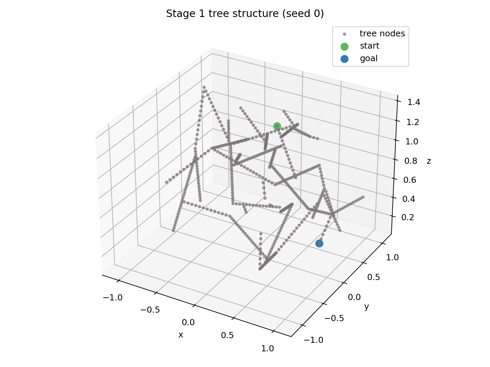
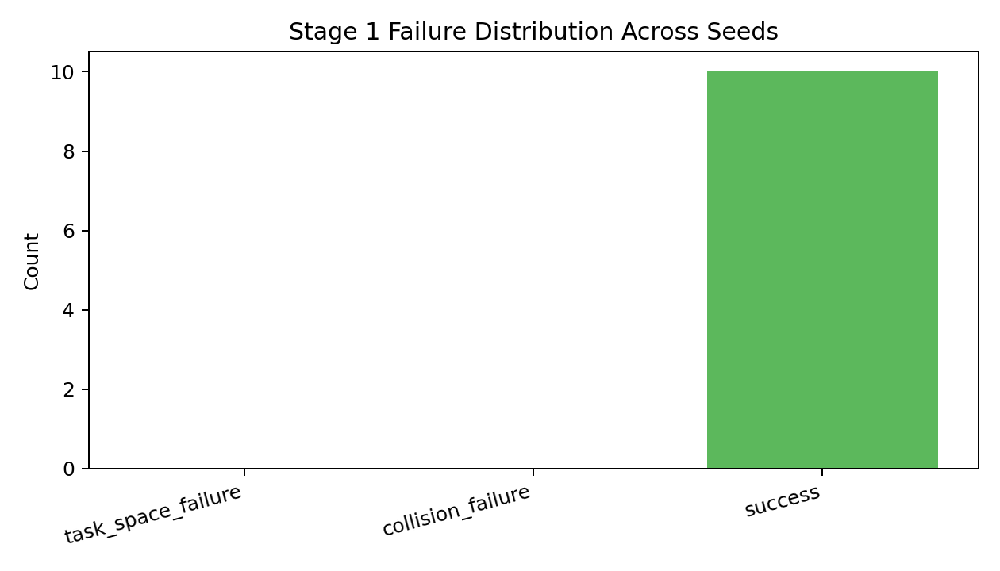
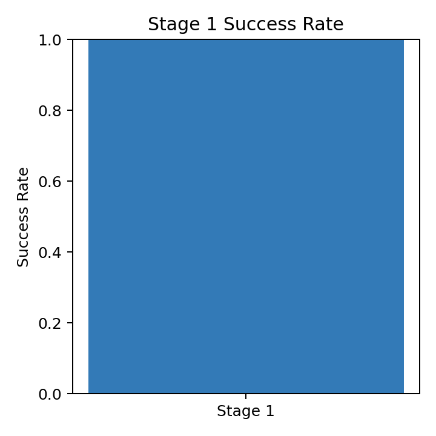
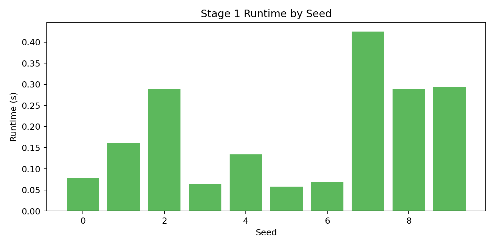
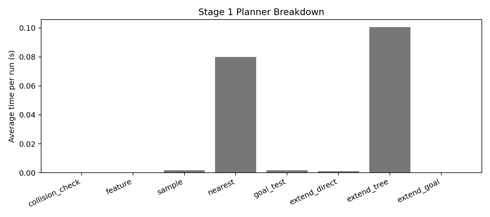

# Stage 1 Debugging Report (20260316_165612)

## Scope

This report summarizes results from:

- `failure_analysis_20260316_165612.json`
- `failure_analysis_20260316_165612.csv`
- `failure_distribution_20260316_165612.png`
- `stage1_success_20260316_165612.png`
- `runtime_by_seed_20260316_165612.png`
- `tree_structure_stage1_seed0_20260316_165612.png`
- `planner_breakdown_20260316_165612.png`
- `plan_profile_seed0_20260316_165612.txt`

Run setup:

- Trials: `10` seeds (`0..9`)
- Per-attempt max time: `30.0s`
- Dist metric: `feature`
- Position resolution: `0.05 m`
- Rotation resolution: `0.1 rad`
- Floating collision: `on`

---

## 1) Workspace Tree Visualization

### Stage 1 (seed 0)

Observation:

- The tree image shows the task-space exploration footprint used by the single-tree Stage 1 RRT.
- This is the quickest way to see whether the sampler is exploring broadly or repeatedly getting trapped near the start or obstacle boundary.

---

## 2) Failure Distribution Analysis

### Distribution plot

From `summary.counts`:

- `task_space_failure`: **0 / 10** (0%)
- `collision_failure`: **0 / 10** (0%)
- `success`: **10 / 10** (100%)

### Bottleneck conclusion

Dominant observed outcome in this run is **success**.

---

## 3) Runtime and Bottleneck Breakdown

### Success-rate plot

### Runtime-by-seed plot

### Planner breakdown plot

From `summary`:

- Stage 1 success rate: **100%**
- Stage 1 avg runtime: **0.186 s**
- Stage 1 avg iterations: **121.3**
- Stage 1 avg nodes created: **1385.0**
- Stage 1 avg poses checked: **1432.5**

Detailed `cProfile` summary: `plan_profile_seed0_20260316_165612.txt`

Interpretation:

- The runtime plot shows whether failures correlate with long searches or early exits.
- The planner breakdown plot shows which internal planner phases consume the most time on average.
- The saved `cProfile` text report is the lower-level function-call view for deeper bottleneck inspection.

---

## Final Answer to Debugging Goals

1. **Workspace tree visualization**: Achieved. A Stage 1 tree image is generated for the first seed in the batch.
2. **Failure distribution analysis**: Achieved. Successes and failures are categorized across seeds and visualized.
3. **Runtime / bottleneck analysis**: Achieved. The runner emits aggregate planner timing, per-seed runtime plots, and `cProfile` output.
