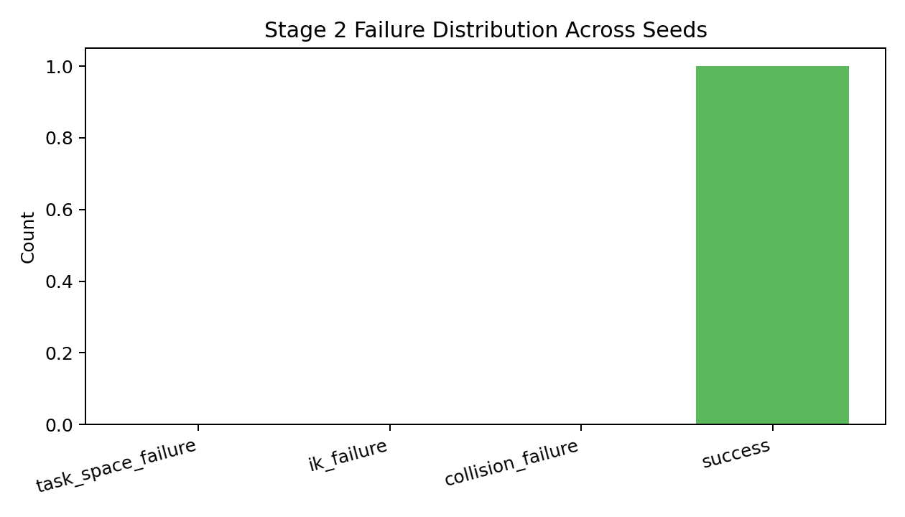
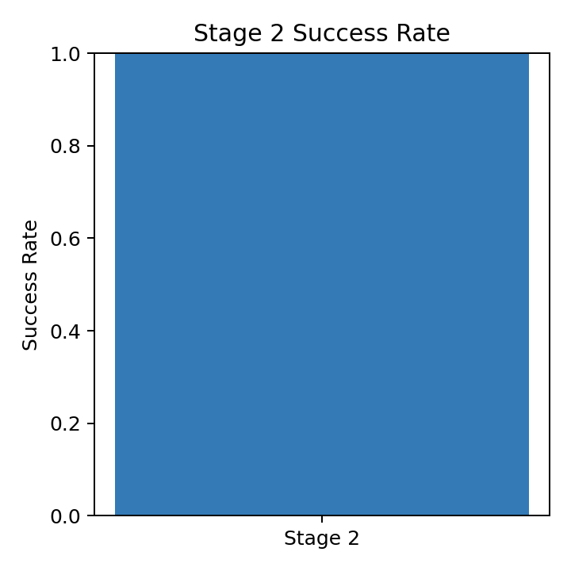
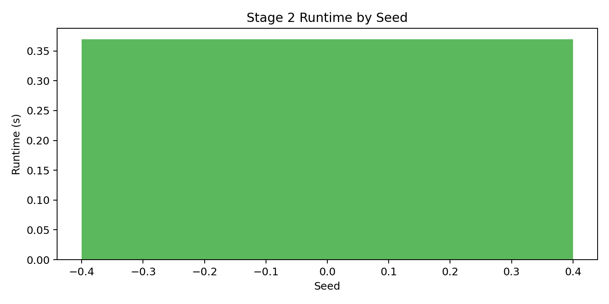
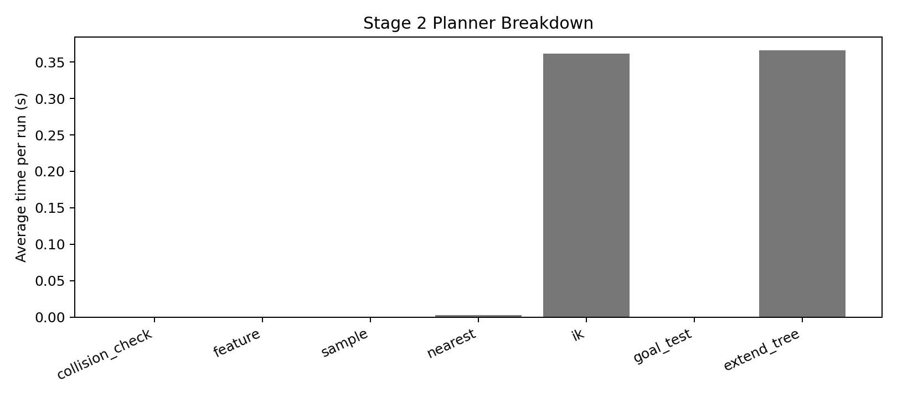

# Stage 2 Debugging Report (20260317_100021)

## Scope

This report summarizes results from:

- `_support/failure_analysis_stage2_20260317_100021.json`
- `_support/failure_analysis_stage2_20260317_100021.csv`
- `_support/failure_distribution_stage2_20260317_100021.png`
- `_support/stage2_success_20260317_100021.png`
- `_support/runtime_by_seed_stage2_20260317_100021.png`
- `_support/tree_structure_stage2_seed0_20260317_100021.png`
- `_support/trajectory_validation_stage2_20260317_100022.png`
- `_support/planner_breakdown_stage2_20260317_100021.png`
- `_support/plan_profile_stage2_seed0_20260317_100021.txt`

Run setup:

- Trials: `1` seeds (`0..0`)
- Per-attempt max time: `3.0s`
- Dist metric: `feature`
- Position resolution: `0.1 m`
- Rotation resolution: `0.2 rad`
- Endpoint IK attempts: `20`
- Collision: `off`

---

## 1) Workspace Tree Visualization

### Stage 2 (seed 0)

Observation:

- The tree image shows the task-space exploration footprint used by the single-tree Stage 2 RRT.
- This is the quickest way to see whether the sampler is exploring broadly or repeatedly getting trapped near the start or obstacle boundary.

---

## 2) Trajectory Validation

First-seed validation summary:

- Collision-free replay: **FAIL**
- Joint continuity: **FAIL**
- Relative transform consistency: **PASS**
- Joint-path source: `planner`

---

## 3) Failure Distribution Analysis

### Distribution plot

From `summary.counts`:

- `task_space_failure`: **0 / 1** (0%)
- `ik_failure`: **0 / 1** (0%)
- `collision_failure`: **0 / 1** (0%)
- `success`: **1 / 1** (100%)

### Bottleneck conclusion

Dominant failure mode in this run is **none**.

---

## 4) Runtime and Bottleneck Breakdown

### Success-rate plot

### Runtime-by-seed plot

### Planner breakdown plot

From `summary`:

- Stage 2 success rate: **100%**
- Stage 2 avg runtime: **0.369 s**
- Stage 2 avg iterations: **18.0**
- Stage 2 avg nodes created: **73.0**
- Stage 2 avg poses checked: **88.0**
- Stage 2 avg IK calls: **192.0**
- Stage 2 avg IK failures: **32.0**

Detailed `cProfile` summary: `_support/plan_profile_stage2_seed0_20260317_100021.txt`

Interpretation:

- The runtime plot shows whether failures correlate with long searches or early exits.
- The planner breakdown plot shows which internal planner phases consume the most time on average.
- The saved `cProfile` text report is the lower-level function-call view for deeper bottleneck inspection.

---

## Final Answer to Debugging Goals

1. **Workspace tree visualization**: Achieved. A Stage 2 tree image is generated for the first seed in the batch.
2. **Failure distribution analysis**: Achieved. Successes and failures are categorized across seeds and visualized.
3. **Per-stage trajectory validation support**: Achieved. The report links the first-seed validation replay plot and validation summary.
