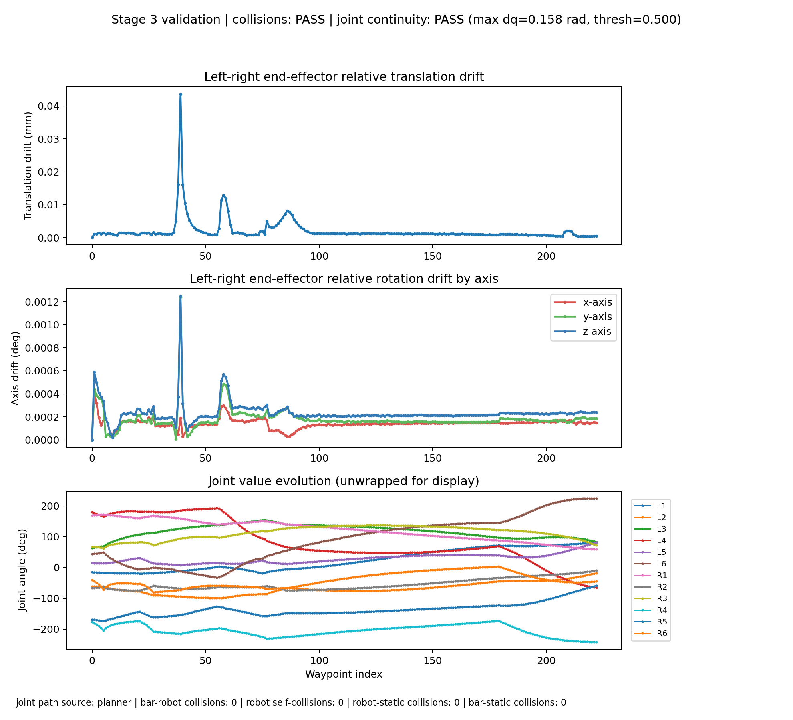
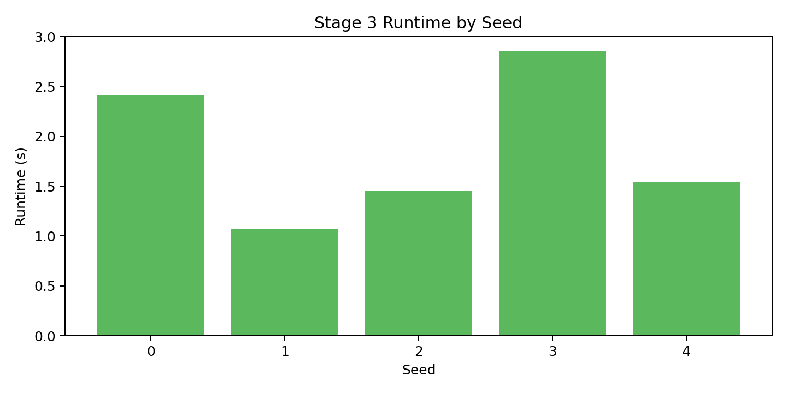
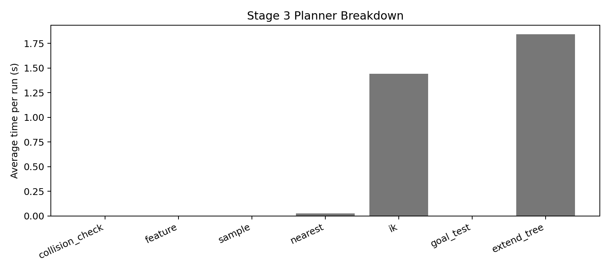

# Stage 3 Debugging Report (20260317_144137)

## Scope

This report summarizes results from:

- `_support/failure_analysis_stage3_20260317_144137.json`
- `_support/failure_analysis_stage3_20260317_144137.csv`
- `_support/failure_distribution_stage3_20260317_144137.png`
- `_support/stage3_success_20260317_144137.png`
- `_support/runtime_by_seed_stage3_20260317_144137.png`
- `_support/tree_structure_stage3_seed0_20260317_144137.png`
- `_support/trajectory_validation_stage3_20260317_144214.png`
- `_support/planner_breakdown_stage3_20260317_144137.png`
- `_support/plan_profile_stage3_seed0_20260317_144137.txt`

Run setup:

- Trials: `5` seeds (`0..4`)
- Per-attempt max time: `30.0s`
- Dist metric: `feature`
- Position resolution: `0.01 m`
- Rotation resolution: `0.025 rad`
- Endpoint IK attempts: `20`
- Joint continuity threshold: `0.2 rad`
- Collision: `on`

---

## 1) Workspace Tree Visualization

### Stage 3 (seed 0)

Observation:

- The tree image shows the task-space exploration footprint used by the single-tree Stage 3 RRT.
- This is the quickest way to see whether the sampler is exploring broadly or repeatedly getting trapped near the start or obstacle boundary.

---

## 2) Trajectory Validation

First-seed validation summary:

- Collision-free replay: **PASS**
- Joint continuity: **PASS**
- Relative transform consistency: **PASS**
- Joint-path source: `planner`
- Max dq: `0.1576 rad`

---

## 3) Failure Distribution Analysis

### Distribution plot

From `summary.counts`:

- `task_space_failure`: **0 / 5** (0%)
- `ik_failure`: **0 / 5** (0%)
- `continuity_failure`: **0 / 5** (0%)
- `collision_failure`: **0 / 5** (0%)
- `success`: **5 / 5** (100%)

### Bottleneck conclusion

Dominant failure mode in this run is **none**.

---

## 4) Runtime and Bottleneck Breakdown

### Validated-success plot

### Runtime-by-seed plot

### Planner breakdown plot

From `summary`:

- Stage 3 validated success rate: **100%**
- Stage 3 task-space path-found rate: **100%**
- Stage 3 avg runtime: **1.868 s**
- Stage 3 avg iterations: **54.6**
- Stage 3 avg nodes created: **538.8**
- Stage 3 avg poses checked: **590.8**
- Stage 3 avg IK calls: **1198.8**
- Stage 3 avg IK failures: **34.4**
- Stage 3 avg max dq: **0.1399 rad**
- Stage 3 avg collision hits: **33.6**

Detailed `cProfile` summary: `_support/plan_profile_stage3_seed0_20260317_144137.txt`

Interpretation:

- The runtime plot shows whether failures correlate with long searches or early exits.
- The planner breakdown plot shows which internal planner phases consume the most time on average.
- The saved `cProfile` text report is the lower-level function-call view for deeper bottleneck inspection.

---

## Final Answer to Debugging Goals

1. **Workspace tree visualization**: Achieved. A Stage 3 tree image is generated for the first seed in the batch.
2. **Failure distribution analysis**: Achieved. Successes and failures are categorized across seeds and visualized.
3. **Per-stage trajectory validation support**: Achieved. The report links the first-seed validation replay plot and validation summary.
