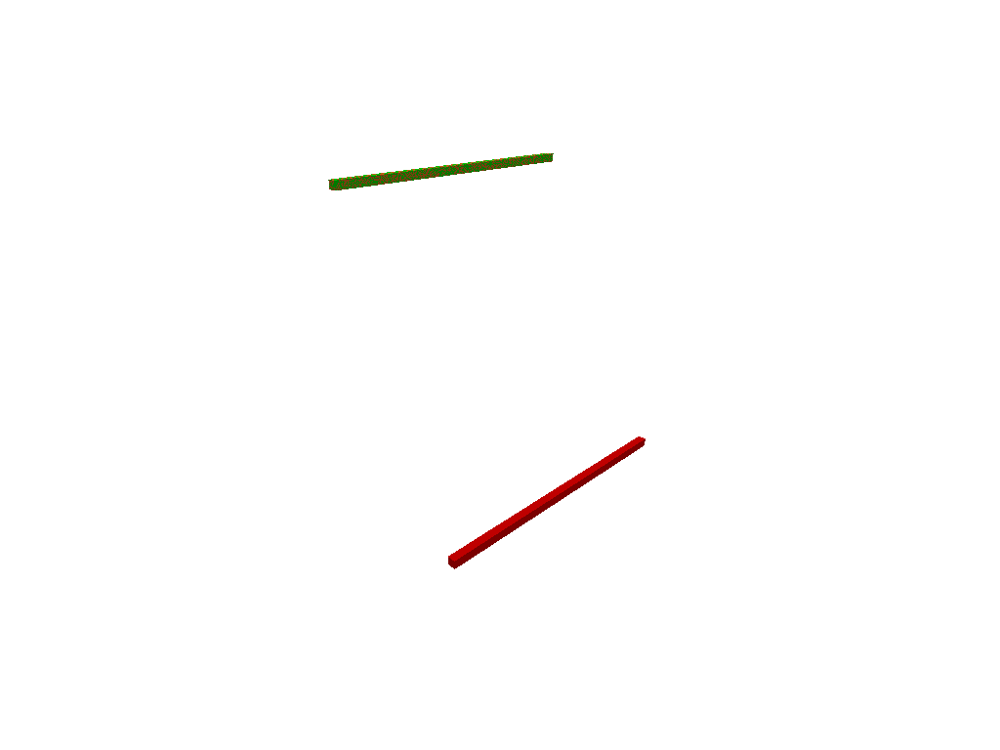
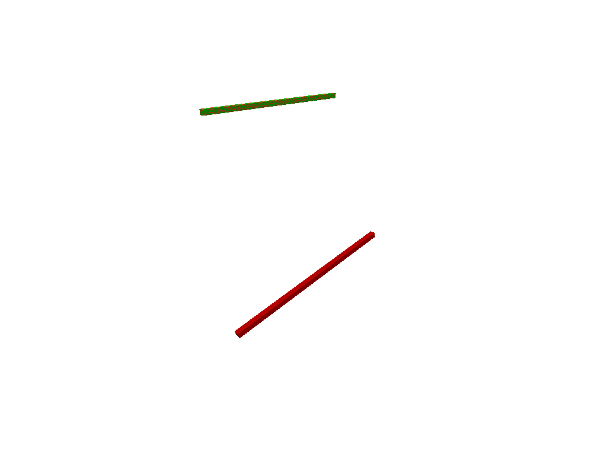
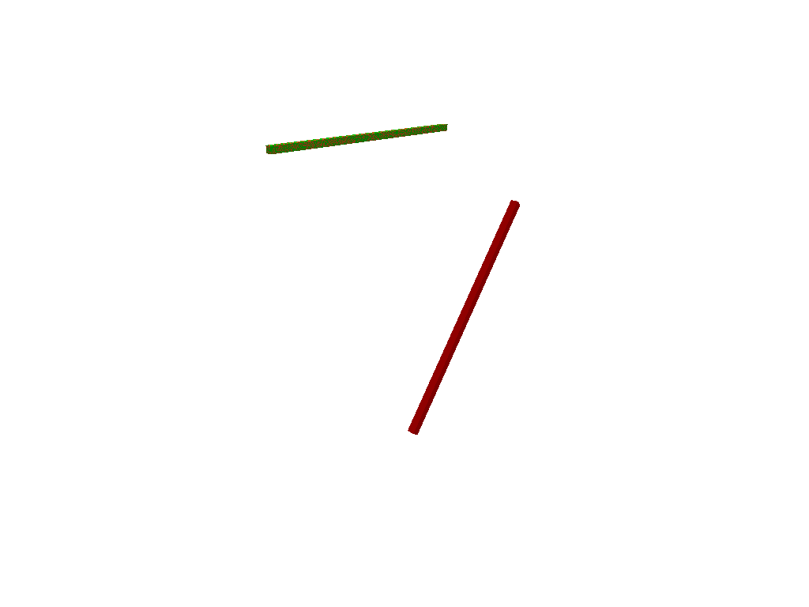
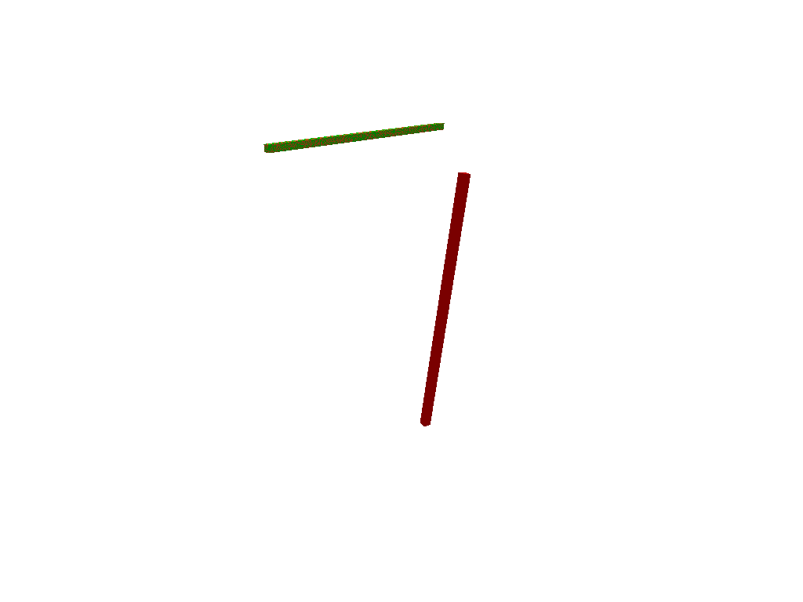
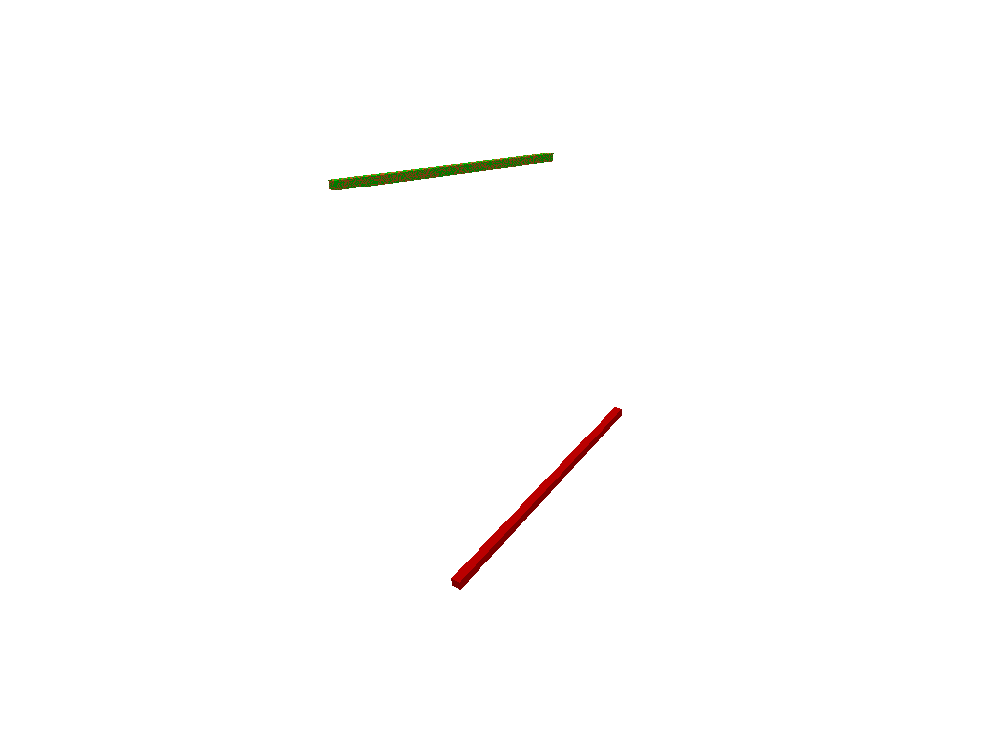
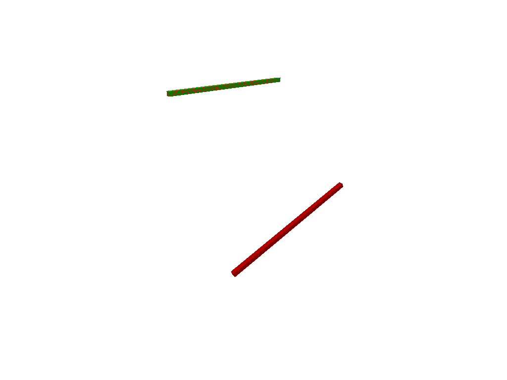

# Stage 3 Front Goal Pose Study (20260317_160349)

## Scope

This report keeps the current Stage 3 start pose fixed, samples front-region goal poses with increasing tilt, filters them with endpoint dual-arm IK plus collision, and runs the Stage 3 planner on the accepted subset.

- Candidate attempts: `12`
- Accepted goals requested: `6`
- Position resolution: `0.01 m`
- Rotation resolution: `0.025 rad`
- Joint continuity threshold: `0.2 rad`
- Endpoint IK attempts: `20`
- Random seed: `0`
- Support JSON: `_support/goal_pose_study_20260317_160349.json`

Reference poses:

- Start pose: `[0.2912, 0.0902, 1.3623]`
- Baseline goal pose: `[0.897, -0.0046, 0.3443]`

---

## Feasibility Filter

| Candidate | Source | Tilt (deg) | Yaw (deg) | Position xyz (m) | Endpoint IK | Accepted | Reason |
| --- | --- | ---: | ---: | --- | --- | --- | --- |
| 0 | baseline | 0.0 | 0.0 | `[0.897, -0.005, 0.344]` | PASS | PASS | accepted |
| 1 | sampled | 14.6 | -5.5 | `[0.804, -0.140, 0.499]` | PASS | PASS | accepted |
| 2 | sampled | 51.9 | 2.6 | `[0.928, 0.008, 0.752]` | PASS | PASS | accepted |
| 3 | sampled | 81.9 | -11.9 | `[0.951, -0.135, 0.823]` | PASS | PASS | accepted |
| 4 | sampled | 7.6 | 8.7 | `[0.894, -0.061, 0.406]` | PASS | PASS | accepted |
| 5 | sampled | 21.0 | -9.0 | `[0.918, 0.037, 0.527]` | PASS | PASS | accepted |
| 6 | sampled | 67.7 | 11.9 | `[0.974, 0.047, 0.786]` | PASS | FAIL | accepted_but_skipped_limit |
| 7 | sampled | 15.3 | -2.7 | `[0.821, 0.057, 0.476]` | PASS | FAIL | accepted_but_skipped_limit |
| 8 | sampled | 30.9 | -0.3 | `[0.957, 0.117, 0.571]` | PASS | FAIL | accepted_but_skipped_limit |
| 9 | sampled | 73.9 | -4.3 | `[0.904, -0.050, 0.776]` | PASS | FAIL | accepted_but_skipped_limit |
| 10 | sampled | 18.4 | -6.5 | `[0.909, -0.121, 0.529]` | PASS | FAIL | accepted_but_skipped_limit |
| 11 | sampled | 47.5 | -6.3 | `[0.955, -0.128, 0.670]` | PASS | FAIL | accepted_but_skipped_limit |
| 12 | sampled | 60.0 | -1.2 | `[0.940, -0.080, 0.699]` | PASS | FAIL | accepted_but_skipped_limit |

Accepted `6` of `13` sampled goals for full planning.

---

## Stage 3 Results

| Candidate | Source | Tilt (deg) | Position xyz (m) | Path found | Validated success | Runtime (s) | Waypoints | Max dq (rad) | Collision-free |
| --- | --- | ---: | --- | --- | --- | ---: | ---: | ---: | --- |
| 0 | baseline | 0.0 | `[0.897, -0.005, 0.344]` | PASS | PASS | 1.193 | 169 | 0.1475 | PASS |
| 1 | sampled | 14.6 | `[0.804, -0.140, 0.499]` | PASS | PASS | 12.871 | 299 | 0.1949 | PASS |
| 2 | sampled | 51.9 | `[0.928, 0.008, 0.752]` | PASS | PASS | 1.005 | 183 | 0.1016 | PASS |
| 3 | sampled | 81.9 | `[0.951, -0.135, 0.823]` | PASS | PASS | 3.363 | 165 | 0.1651 | PASS |
| 4 | sampled | 7.6 | `[0.894, -0.061, 0.406]` | PASS | PASS | 6.210 | 192 | 0.1935 | PASS |
| 5 | sampled | 21.0 | `[0.918, 0.037, 0.527]` | PASS | PASS | 2.041 | 161 | 0.1123 | PASS |

Validated Stage 3 success: `6 / 6` accepted goals.

---

## Goal Visuals

### Candidate 0 (0.0 deg)

- Video: [_support/goal_pose_study_20260317_160349_candidate00.mp4](_support/goal_pose_study_20260317_160349_candidate00.mp4)
- JointTrajectory JSON: [_support/goal_pose_study_20260317_160349_candidate00_JointTrajectory.json](_support/goal_pose_study_20260317_160349_candidate00_JointTrajectory.json)
- Metadata JSON: [_support/goal_pose_study_20260317_160349_candidate00_metadata.json](_support/goal_pose_study_20260317_160349_candidate00_metadata.json)
- Validation plot: [_support/trajectory_validation_stage3_20260317_160351.png](_support/trajectory_validation_stage3_20260317_160351.png)

### Candidate 1 (14.6 deg)

- Video: [_support/goal_pose_study_20260317_160349_candidate01.mp4](_support/goal_pose_study_20260317_160349_candidate01.mp4)
- JointTrajectory JSON: [_support/goal_pose_study_20260317_160349_candidate01_JointTrajectory.json](_support/goal_pose_study_20260317_160349_candidate01_JointTrajectory.json)
- Metadata JSON: [_support/goal_pose_study_20260317_160349_candidate01_metadata.json](_support/goal_pose_study_20260317_160349_candidate01_metadata.json)
- Validation plot: [_support/trajectory_validation_stage3_20260317_160407.png](_support/trajectory_validation_stage3_20260317_160407.png)

### Candidate 2 (51.9 deg)

- Video: [_support/goal_pose_study_20260317_160349_candidate02.mp4](_support/goal_pose_study_20260317_160349_candidate02.mp4)
- JointTrajectory JSON: [_support/goal_pose_study_20260317_160349_candidate02_JointTrajectory.json](_support/goal_pose_study_20260317_160349_candidate02_JointTrajectory.json)
- Metadata JSON: [_support/goal_pose_study_20260317_160349_candidate02_metadata.json](_support/goal_pose_study_20260317_160349_candidate02_metadata.json)
- Validation plot: [_support/trajectory_validation_stage3_20260317_160412.png](_support/trajectory_validation_stage3_20260317_160412.png)

### Candidate 3 (81.9 deg)

- Video: [_support/goal_pose_study_20260317_160349_candidate03.mp4](_support/goal_pose_study_20260317_160349_candidate03.mp4)
- JointTrajectory JSON: [_support/goal_pose_study_20260317_160349_candidate03_JointTrajectory.json](_support/goal_pose_study_20260317_160349_candidate03_JointTrajectory.json)
- Metadata JSON: [_support/goal_pose_study_20260317_160349_candidate03_metadata.json](_support/goal_pose_study_20260317_160349_candidate03_metadata.json)
- Validation plot: [_support/trajectory_validation_stage3_20260317_160418.png](_support/trajectory_validation_stage3_20260317_160418.png)

### Candidate 4 (7.6 deg)

- Video: [_support/goal_pose_study_20260317_160349_candidate04.mp4](_support/goal_pose_study_20260317_160349_candidate04.mp4)
- JointTrajectory JSON: [_support/goal_pose_study_20260317_160349_candidate04_JointTrajectory.json](_support/goal_pose_study_20260317_160349_candidate04_JointTrajectory.json)
- Metadata JSON: [_support/goal_pose_study_20260317_160349_candidate04_metadata.json](_support/goal_pose_study_20260317_160349_candidate04_metadata.json)
- Validation plot: [_support/trajectory_validation_stage3_20260317_160427.png](_support/trajectory_validation_stage3_20260317_160427.png)

### Candidate 5 (21.0 deg)

- Video: [_support/goal_pose_study_20260317_160349_candidate05.mp4](_support/goal_pose_study_20260317_160349_candidate05.mp4)
- JointTrajectory JSON: [_support/goal_pose_study_20260317_160349_candidate05_JointTrajectory.json](_support/goal_pose_study_20260317_160349_candidate05_JointTrajectory.json)
- Metadata JSON: [_support/goal_pose_study_20260317_160349_candidate05_metadata.json](_support/goal_pose_study_20260317_160349_candidate05_metadata.json)
- Validation plot: [_support/trajectory_validation_stage3_20260317_160432.png](_support/trajectory_validation_stage3_20260317_160432.png)
