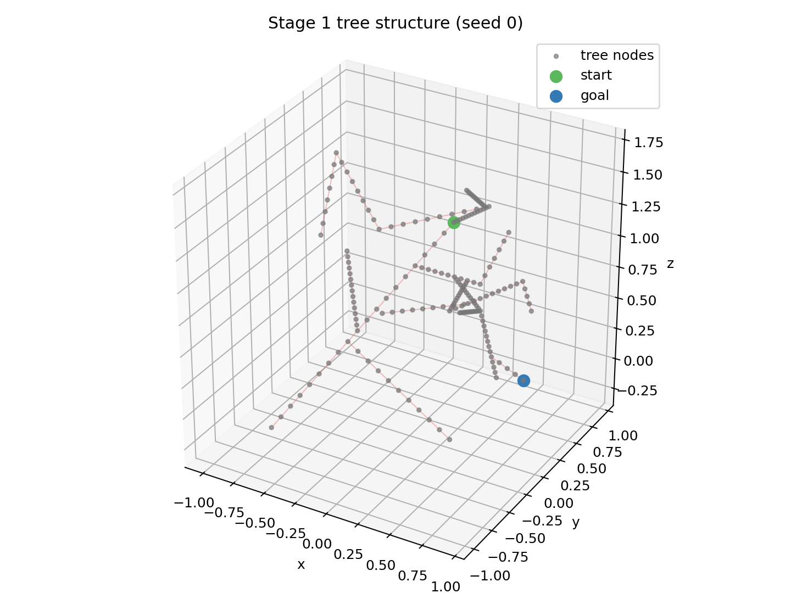
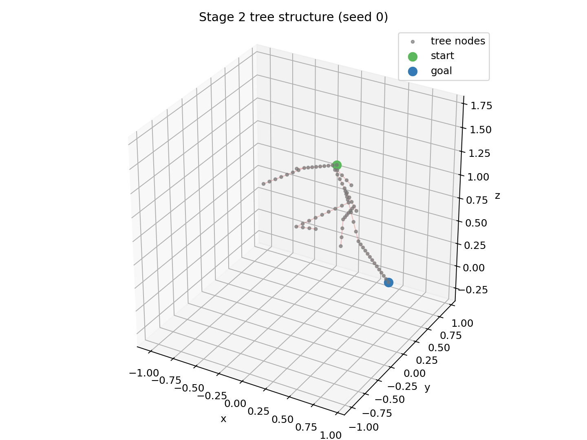
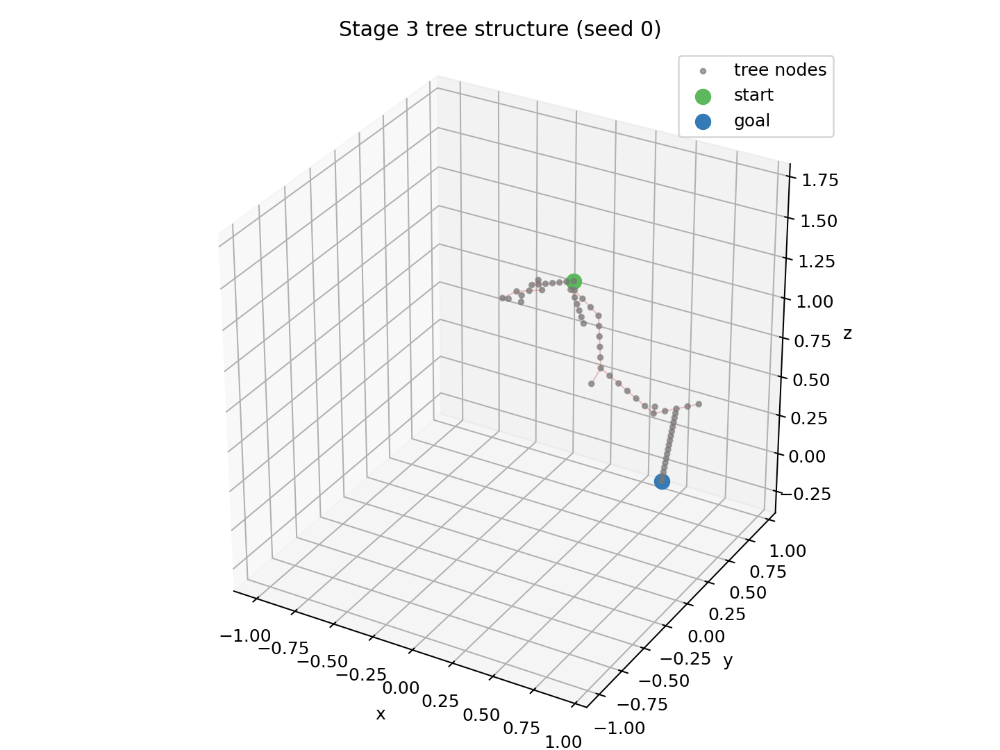
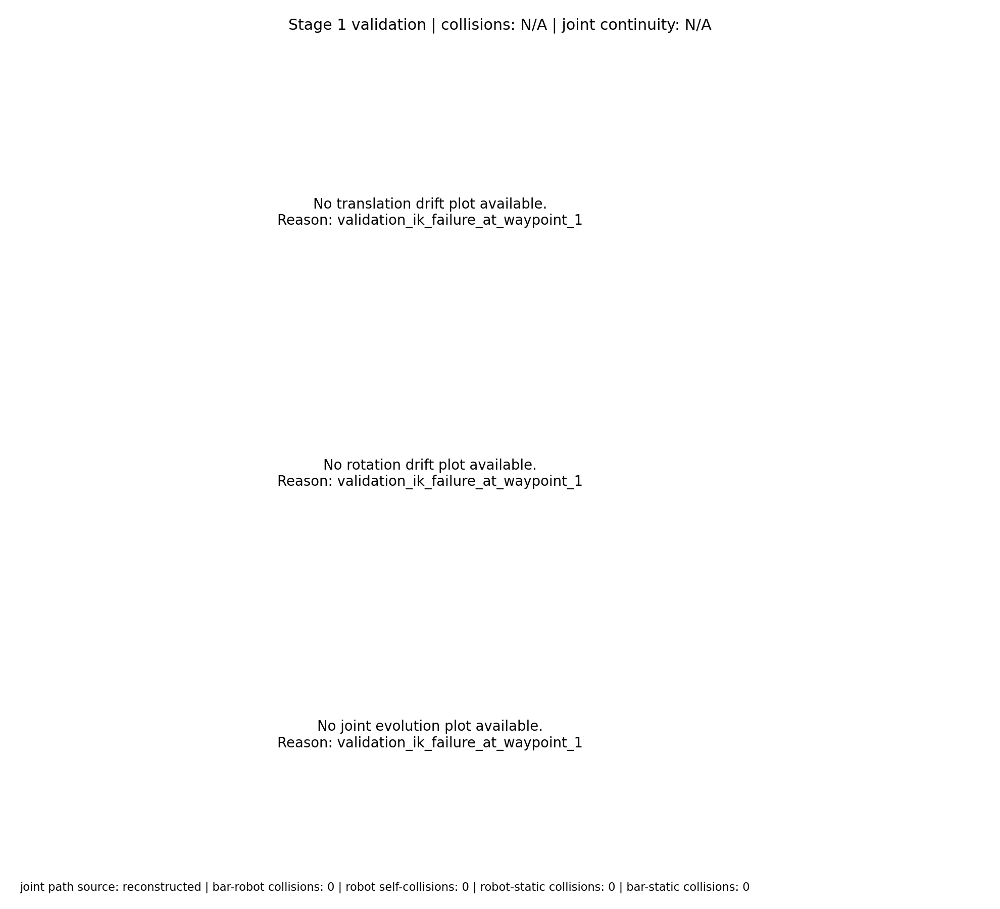
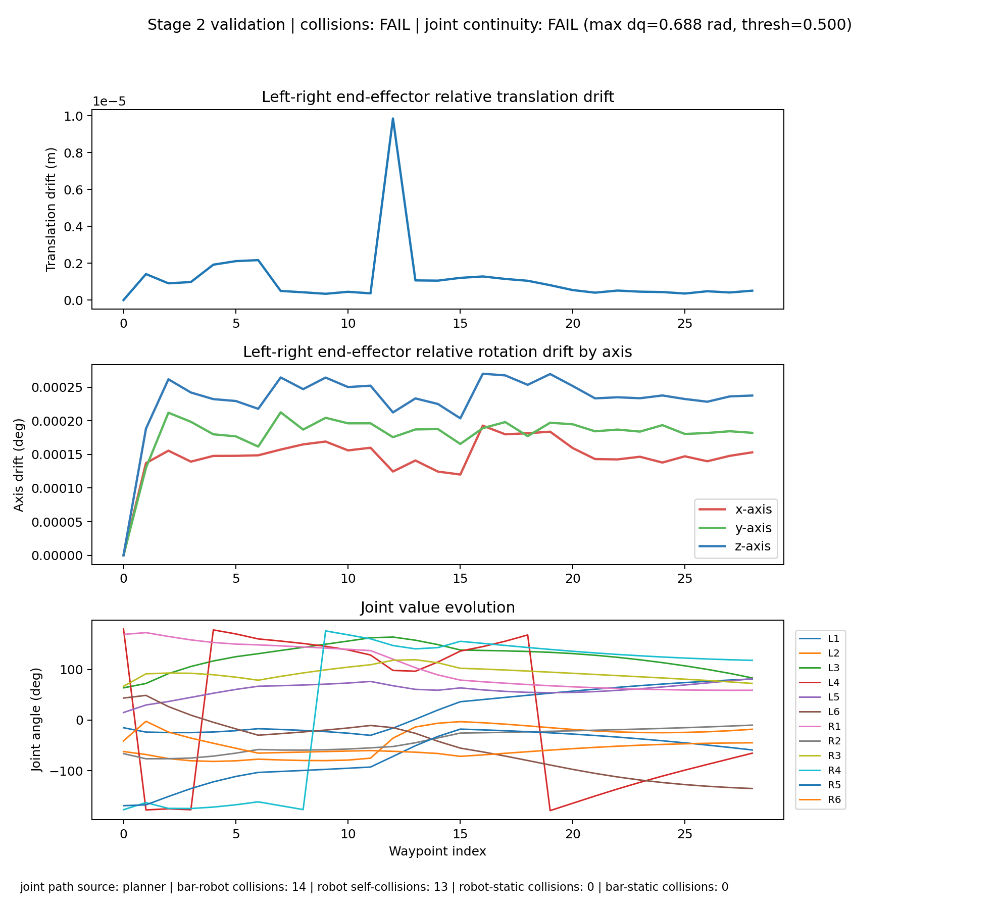
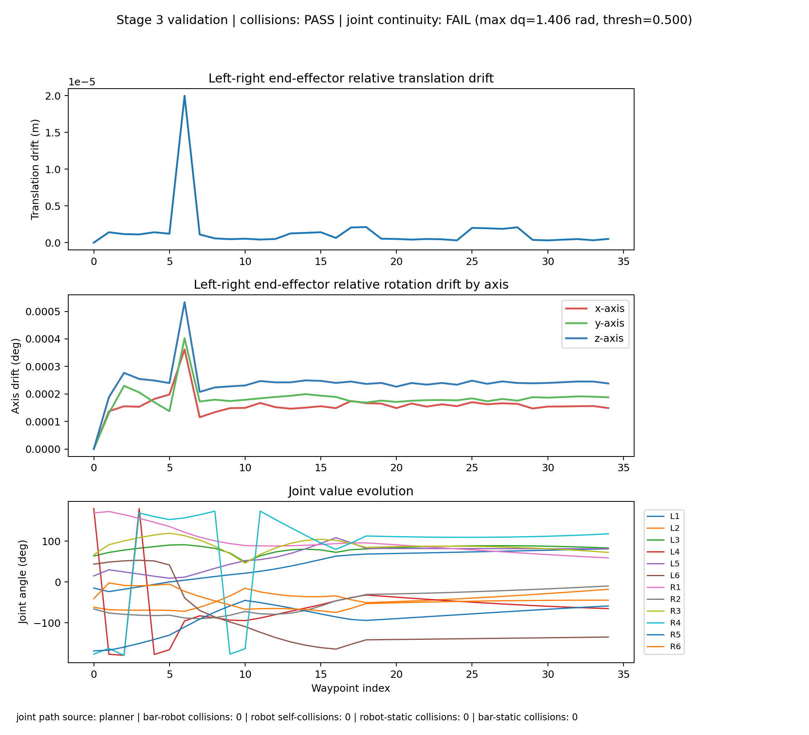
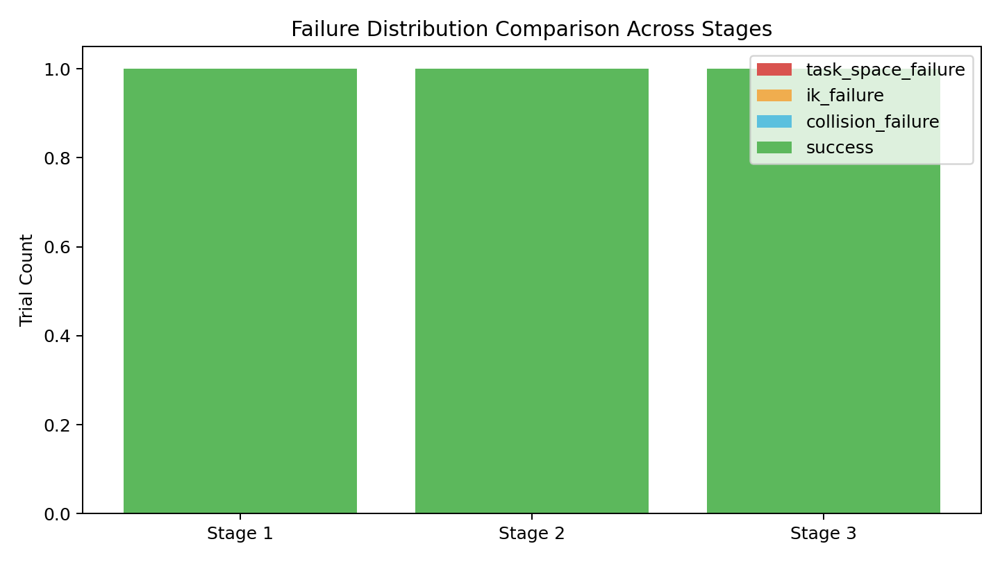
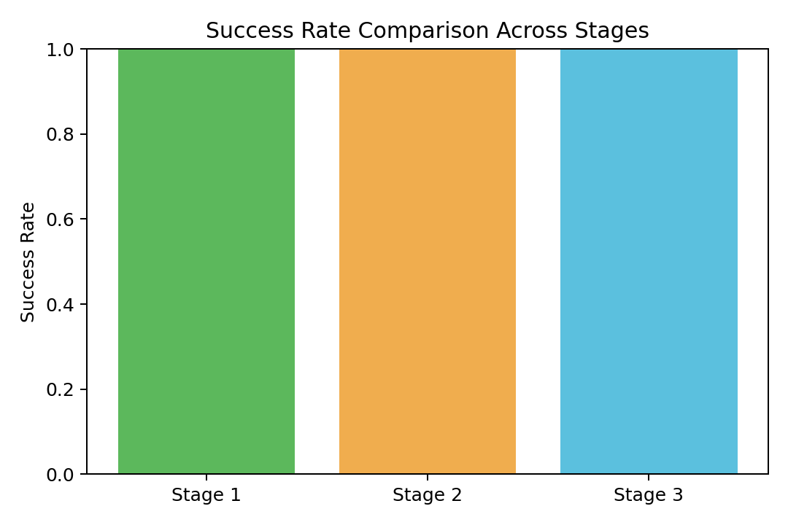
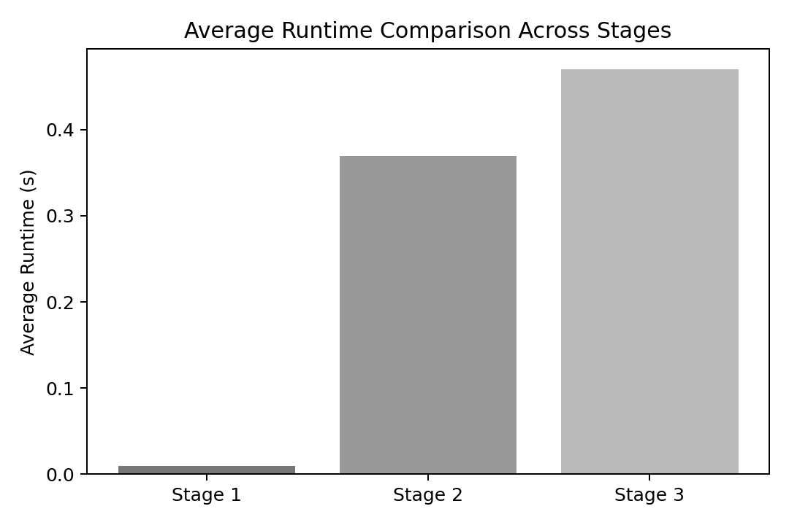
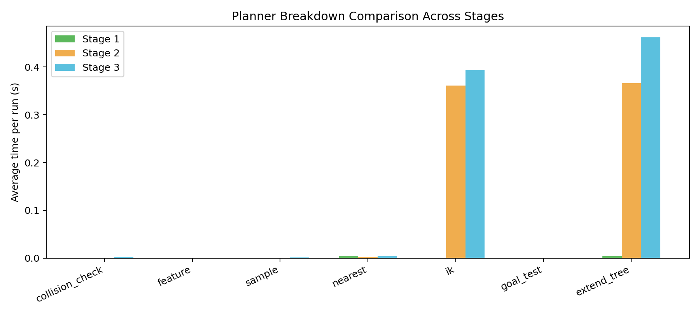

# Stage Comparison Debugging Report (20260317_100021)

## Scope

This report compares Stages 1, 2, and 3 across the same seed range.

Run setup:

- Trials per stage: `1` seeds (`0..0`)
- Per-attempt max time: `3.0s`
- Dist metric: `feature`
- Position resolution: `0.1 m`
- Rotation resolution: `0.2 rad`
- Endpoint IK attempts: `20`

---

## 1) Workspace Tree Visualization

The first seed is rendered for each stage so the exploration footprint can be compared directly.

### Stage 1

### Stage 2

### Stage 3

Observation:

- Stage 1 isolates task-space exploration.
- Stage 2 shows how dual-arm IK feasibility prunes the same task-space search.
- Stage 3 shows the additional pruning introduced by collision checking.

---

## 2) Trajectory Validation

The first-seed trajectory replay validation plot is included for each stage.

### Stage 1 Validation

- Collision-free: **N/A**, joint continuity: **N/A**, relative transform: **N/A**
- Joint-path source: `reconstructed`

### Stage 2 Validation

- Collision-free: **FAIL**, joint continuity: **FAIL**, relative transform: **PASS**
- Joint-path source: `planner`

### Stage 3 Validation

- Collision-free: **PASS**, joint continuity: **FAIL**, relative transform: **PASS**
- Joint-path source: `planner`

---

## 3) Failure Distribution Analysis

| Stage | Task-space | IK | Collision | Success | Dominant failure |
| --- | ---: | ---: | ---: | ---: | --- |
| Stage 1 | 0 | 0 | 0 | 1 | none |
| Stage 2 | 0 | 0 | 0 | 1 | none |
| Stage 3 | 0 | 0 | 0 | 1 | none |

Interpretation:

- Stage 1 failures are pure task-space failures.
- New IK failures in Stage 2 quantify the cost of enforcing dual-arm feasibility.
- New collision failures in Stage 3 quantify the extra cost of self/environment avoidance once IK already succeeds.

---

## 4) Per-Stage Comparison

| Stage | Success rate | Avg runtime (s) | Avg iterations | Avg nodes | Avg poses checked | Avg IK calls | Avg collision hits |
| --- | ---: | ---: | ---: | ---: | ---: | ---: | ---: |
| Stage 1 | 100% | 0.009 | 18.0 | 189.0 | 188.0 | 0.0 | 0.0 |
| Stage 2 | 100% | 0.369 | 18.0 | 73.0 | 88.0 | 192.0 | 0.0 |
| Stage 3 | 100% | 0.470 | 45.0 | 58.0 | 101.0 | 221.0 | 24.0 |

Detailed stage reports:

- `debug_report_stage1_20260317_100021.md`
- `debug_report_stage2_20260317_100021.md`
- `debug_report_stage3_20260317_100021.md`

---

## Final Answer to Debugging Goals

1. **Workspace tree visualization**: Achieved. The report includes one tree image per stage for the same seed.
2. **Failure distribution analysis**: Achieved. Failure categories are compared side by side across all three stages.
3. **Per-stage comparison**: Achieved. Success rate, runtime, bottleneck mix, and planner timing are summarized side by side across Stages 1, 2, and 3.
